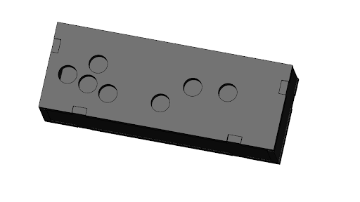
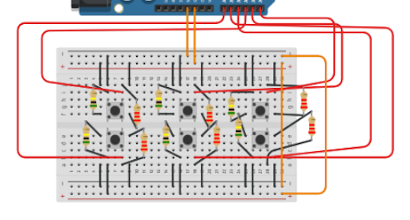

# **Project Overview**

## Table of Contents

1. [Budget and Components](#budget-and-components)
2. [Media](#media)
3. [Mechanical Design](#mechanical-design)
4. [Electrical and Firmware Design](#electrical-and-firmware-design)
5. [Software Design](#software-design)
6. [Energy Flow & System Diagrams](#diagrams)

---

<model-viewer src="pathfinder.glb" ar ar-modes="scene-viewer webxr quick-look" camera-controls tone-mapping="neutral" poster="poster.png" shadow-intensity="1" camera-orbit="-1053deg 73.25deg 1.936m" field-of-view="30deg"> </model-viewer>

## **Budget and Components**

### Spending Breakdown

| **Component/Material**       | **Cost (USD)**        | **Source**       |
| ---------------------------- | --------------------- | ---------------- |
| Computer Monitor             | Free (Estimated: $50) | PIE Studio       |
| Micro HDMI to HDMI Cord      | $8.79                 | Amazon           |
| Raspberry Pi 4 Model B       | $56                   | Amazon           |
| Medium Density Fiberboard    | Free (Estimated: $15) | Olin Shop        |
| Black Gouache Paint          | Free (Estimated: $3)  | Library Workroom |
| Buttons                      | $11.49                | Amazon           |
| Spray Paint                  | Free (Estimated: $5)  | Weissman Foundry |
| Breadboard, Resistors, Wires | Free (Estimated: $3)  | PIE Room         |

**Total Estimated Cost**: **$152.28** (including estimated values).

### Total Cost and Budget Overview

Our budget totals to be around 150 dollars, which is well under the 250 dollar budget given to us by the PIE teaching team. Looking back on our project, while we could have bought nicer supplies like a newer RasPi or Monitor, or more expensive paint/wood, there was no need. Our machine functions for its intended purpose, and the cheap materials we had on hand helped us achieve our end goal.

---

## **Media**

### Final System in Action

<iframe src="https://albumizr.com/a/5Bc-" scrolling="no" frameborder="0" allowfullscreen width="700" height="400"></iframe>

---

### **Mechanical Design**

The mechanical design of the arcade machine emphasizes durability, modularity, and ergonomic user interaction.

#### Overview:

The final structure was laser-cut from 24”x18” ¼” MDF sheets, with gouache-painted inner panels and spray-painted outer surfaces. The modular control panel allows for easy troubleshooting, while access to the back enables maintenance. A slanted screen holder optimizes viewing angles and screen height for user comfort.

#### Key Features:

- **Materials:** MDF sheets, gouache, and spray paint.
- **Fabrication Methods:** Laser cutting and wood glue assembly with sanded joints for improved adhesion.
- **Modularity:** Removable control panel and accessible screen holder for power button operation.

---

#### **CAD Rendering**

Replace this with a CAD rendering or diagram showcasing the design:  
  
  
_Figure: CAD rendering of the arcade machine structure._

---

### Electrical and Firmware Design

Our electrical system has three main components: the monitor, Raspberry Pi, and the breadboard/buttons/circuits.

The monitor and Raspberry Pi are both powered separately. The Raspberry Pi is powered via the USB C port on the RasPi and is connected to one of the USB A ports on our laptops. The monitor is plugged directly into a wall outlet.

The breadboard is powered via the 5V pin of the Rasberry Pi, and is also connected to the ground of the Pi. The breadboard consists of multiple buttons with pulldown resistors. When the buttons are pressed, current and voltage passes through the lower powered resistors attached to the button, and that current is read by a GPIO pin on the Raspberry Pi.

The Raspberry Pi is connected to the monitor via its micro HDMI port, connecting to one of the two HDMI ports on the monitor.

**Example**:  

_Figure: Circuit schematic showing connections between components._

_Figure: Circuit interfacing with the Raspberry Pi and monitor in the back of the machine._

---

### Software Design

The software for **Hatchling's Quest: Pathfinding Trials** is designed to deliver an intuitive, engaging, and educational gaming experience while visualizing pathfinding algorithms in action.

#### Overview:

The software is divided into three main areas:

- **Game Interface**: Handles the GUI, animations, and user input using **Pygame**.
- **Pathfinding Algorithms**:
  - **Dijkstra's Algorithm** (Level 1): Computes shortest paths.
  - **Q-Learning** (Level 2): Enables reward-based navigation.
- **Game Logic**: Manages screens, game states, and leaderboards.

#### Key Modules:

- **`run_game.py`**: Coordinates game flow.
- **`grid/grid.py`**: Defines the pathfinding grid.
- **Pathfinding Modules**:
  - **`sprites/DijkstraSprite.py`**: Implements Dijkstra’s Algorithm.
  - **`sprites/QLearningSprite.py`**: Implements Q-Learning.
- **Screens**: Main menu, instructions, and interactive gameplay feedback.
- **Leaderboard**: Tracks and displays high scores via **`leaderboard/leaderboard.py`**.

#### **Dependencies**

The software relies on the following external libraries:

- **Python 3.11.7**: Core language used for development.
- **NumPy (2.2.0)**: Used for matrix operations in Q-Learning, including Q-table computations.
- **Pygame (2.6.1)**: Provides the framework for rendering the game interface and managing user input.

---

#### **Flow Diagram for Game**

The following flow diagram illustrates the architecture and flow of the game, showing transitions between levels, screens, and algorithms:

  
_Figure: Flow diagram representing game architecture and flow._

---

#### **UML Diagram**

The UML diagram below showcases the architecture and relationships within the game. It highlights key components, such as the flow between screens, sprite classes, and grid interactions, as well as how algorithms like Dijkstra's and Q-Learning are integrated:

  
_Figure: UML diagram representing the game architecture and component relationships._

---

#### **Link to Source Code**

The complete source code for the project is hosted on GitHub:  
[GitHub Repo Link](https://github.com/dakotacsk/pie_shortestpathfindingvisualization)

More details to be found in subpage named Software Process.

---

## **Diagrams**

### Data and Energy Flow Diagram

Insert a high-level diagram showing how energy and data move through the system.

**PLACEHOLDER**: Add data and energy flow diagram.

**Example**:  
  
_Figure: Data and energy flow in the arcade system._

---

### Subsystem Diagram

**Example**:

_Figure: Subsystem relationships across hardware, software, and firmware._

---
