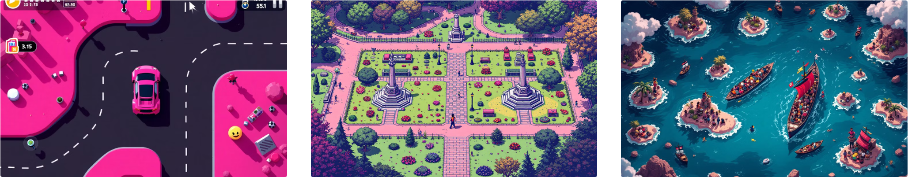

## Table of Contents

1. [Sprint 1](#sprint-1)
2. [Sprint 2](#sprint-2)
3. [Narrative Ideations](#narrative-ideations)
4. [Sprint 3](#sprint-3)

---

# Process

## Sprint 1

Our goal was to build a **proof of concept** with:

1. A functional **grid system**.
2. A **Dijkstra agent** that:
   - Prioritizes **green reward blocks**.
   - Avoids **red punishment blocks**.
3. Testing **Pygame** as the main library.
4. Early progress on the **Q-Learning agent**.
5. Teaching users the difference between **Dijkstra’s Algorithm** and **Q-Learning**.

---

### **Challenges and Design Decisions**

**1. External Libraries vs. Customizability**

- **Why**: Existing libraries (e.g., Gym) ran in their own environments and were hard to customize.
- **Decision**: Full control over **sprites** and mechanics for flexibility.

> **Pivot**: Develop **modular tools** to speed up development without losing control.

**2. Teaching Dijkstra vs. Q-Learning**

- **Challenge**: The two algorithms are too different for straightforward comparison.
- **Struggle**: Aligning gameplay and storyline to highlight their unique applications.

> **Pivot**: Refocus the storyline to show how each algorithm solves **unique problems** instead of directly comparing them.

**3. Mechanics Development**

- **Issue**: Without external libraries, we’re spending significant time on foundational mechanics.

> **Pivot**: Use **lightweight tools** (e.g., GUI libraries) to improve efficiency without losing control.

**4. Playtesting Barriers**

- **Problem**: The game feels too technical for players without **RL knowledge**.

> **Pivot**:
>
> - Add **visual aids** (e.g., overlays, step-by-step explanations) to teach key mechanics.
> - Simplify early levels for intuitive gameplay.

**5. Grid Size and Performance**

- **Challenge**: Larger grids stress **GPU/CPU** resources and increase training time.
- **Why not pre-train?**: Real-time, dynamic training is a key feature.

> **Pivot**:
>
> - Start with **smaller grids** and scale gradually.
> - Optimize Q-Learning to reduce computational overhead.

**6. Storyline Integration**

- **Issue**: Tying gameplay, RL mechanics, and a compelling storyline is difficult.

> **Pivot**: Simplify the narrative to focus on **goal-driven challenges** where each algorithm’s strengths shine.

---

## Sprint 2

For Sprint 2, we focused on **graphics, gameplay tweaks**, and building an **MVP** styled as an **old arcade game**.

---

### **1. Q-Learning Enhancements**

- Fully functional **Q-Learning sprite**.
- Real-time **Q-Table Visualization** for intuitive learning feedback.

### **2. User Interface**

- Functional **Home Page** and two **Instruction Screens**:
  1.  Simple gameplay explanation.
  2.  Overview of **Dijkstra’s Algorithm** and **Q-Learning**.
- Added a **Credits Screen** with consistent styling.

### **3. Gameplay Feedback**

- On-screen messages show:
  - Current step of the Q-Learning sprite.
  - Progress out of **5000 max steps**.

### **4. Visual Updates**

- Adjusted to a **horizontal layout** for arcade monitor compatibility.
- Limited controls to **6 buttons** for simplicity.

### **5. Scrolling Text**

- Standardized scrolling text animations with a **base class**.

### **6. Leaderboard Screen**

- Added a **non-functional leaderboard screen** (debugging in progress).

### **7. Explanation Screen**

- Added screens to explain **sprite oscillation** and invalid moves during Q-Learning.

<iframe src="https://albumizr.com/a/0rAh" scrolling="no" frameborder="0" allowfullscreen style="height: 500px; width: 60vw; display: block; margin: 0 auto; object-fit: contain;"></iframe>

---

### **Challenges and Potential Pivots**

**1. Storyline Development**

- **Issue**: We still struggle to develop a cohesive storyline.

> **Pivot**:
>
> - Use the **Dijkstra sprite** as a tutorial to introduce mechanics.
> - Simplify the narrative into **progression-based challenges**.

**2. Q-Table Display**

- **Issue**: Q-Table numbers overlap, creating clutter.

> **Fix**:
>
> - Tweak reward/punishment values.
> - Round displayed Q-table numbers for clarity.

**3. Leaderboard Issues**

- **Issue**: Leaderboard functionality is incomplete.

> **Fix**: Debug and finalize leaderboard tracking for high scores.

**4. Max Steps Taking Too Long**

- **Issue**: **5000 steps** feel excessive and slow down gameplay.

> **Pivot**:
>
> - Allow users to **adjust step sizes** (e.g., 100, 500, 1000).
> - Streamline gameplay to reduce unnecessary steps.

**5. Gameplay Consistency**

- **Issue**: The game doesn’t always behave as expected.

> **Fix**:
>
> - Perform a **parameter sweep** to balance rewards, punishments, and grid size.
> - Ensure consistent gameplay that’s **challenging but winnable**.

---

## Narrative Ideations

In Sprint 2, we explored potential storylines to align gameplay with engaging narratives.

**1. Car Game**

- **Concept**: A car loses gas with each step.
  - **Red squares**: Obstacles increasing gas loss.
  - **Green squares**: Gas stations for refueling.

> **Fix**:
>
> - **Dijkstra**: Efficient route to gas stations.
> - **Q-Learning**: Adaptive navigation to avoid obstacles.

**2. Park Game**

- **Concept**: Park-goers navigate delays and rewards.
  - **Red squares**: Monuments or benches.
  - **Green squares**: Fields requiring maintenance.

> **Fix**:
>
> - **Dijkstra**: Optimized static pathfinding.
> - **Q-Learning**: Adapts dynamically to new obstacles.

**3. Immigrant Boat Game**

- **Concept**: Escape threats while maintaining morale.
  - **Green squares**: Safe havens.
  - **Red squares**: Pirates reducing morale.

> **Fix**:
>
> - **Dijkstra**: Safest, most optimal path.
> - **Q-Learning**: Learns dynamically to avoid threats.

---

## Next Steps

- Select and integrate a streamlined **narrative**.
- Align **rewards and punishments** with storyline progression.
- Optimize mechanics to balance **user engagement** and **educational value**.

Here’s **Sprint 3** formatted cleanly and consistently with your earlier sections:

---

## Sprint 3

### Narrative Ideation

We settled on a storyline where **baby turtles** must find their way to the ocean after hatching. The game aims to:

1. Educate users on **reinforcement learning algorithms**.
2. Teach users about the natural behavior of turtle hatchlings.
3. Spread awareness on the issue of **light pollution** and its impact on nature.

---

### Final Updates

- **Sprite images added!**
- **Storyline integrated** into the gameplay.
- **Bugs fixed** to improve robustness.
- **Option to choose max steps** added for better gameplay flexibility.
- **File reorganization** completed to prepare for a **downloadable app**.

---

### Challenges and Pivots

At this stage, the primary focus is on:

> **Pivot**: Finishing the **final touches** and fixing all remaining **bugs** to ensure the game is robust and ready for release.

## You can see the final results in the [Project Overview](project.md)! Alternatively, feel free to play the game using the download page.
