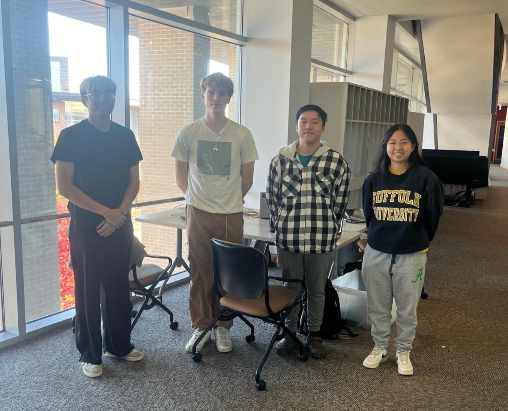

{style="height: 40vh; width: auto; display: block; margin: 0 auto; object-fit: contain;" }

<figcaption>Our team combines expertise in software development, mechanical engineering, and UI/UX design to bring PathFinder to life. </figcaption>

---

# Meet the passionate individuals behind the project:

## **Dakota**

{style="height: 20vh; width: auto; display: block; margin: 0 auto; object-fit: contain;" }  
**Role**: Pathfinding Algorithm Specialist & UI/UX Designer  
Dakota is focused on understanding pathfinding algorithms, designing user-friendly interfaces, and creating physical demonstrations of abstract concepts.

---

## **Vishnu**

{style="height: 20vh; width: auto; display: block; margin: 0 auto; object-fit: contain;" }  
**Role**: Raspberry Pi Integration & Pathfinding Algorithms  
Vishnu specializes in integrating software with Raspberry Pi, working on approachable UI design, and exploring pathfinding algorithms.

---

## **Khoi**

{style="height: 20vh; width: auto; display: block; margin: 0 auto; object-fit: contain;" }  
**Role**: Mechanical-Software Bridge & Real-Time Visuals  
Khoi bridges the gap between mechanical and software components, creating real-time digital visuals and ensuring seamless integration.

---

## **Chris**

{style="height: 20vh; width: auto; display: block; margin: 0 auto; object-fit: contain;" }

**Role**: Mechanical, Electrical, and Software Design Integration  
Chris excels at integrating mechanical, electrical, and software designs into cohesive, functional systems inspired by 1980s arcade machines.

---
